# Analysis Report

## Dataset: goodreads.csv

## Insights
Based on the provided summary statistics and insights from the Goodreads dataset, here are the key findings and insights:

### General Overview
- The dataset contains 10,000 books with various attributes related to their identification, publication, authorship, and user ratings.
- It includes columns for book identification (IDs), counts (like `books_count`), ISBNs, authors, publication information, language, ratings, and reviews.

### Missing Values
- Several fields have missing values contributing to data quality issues:
  - `isbn` has 700 missing values.
  - `isbn13` has 585 missing values.
  - `original_publication_year` has 21 missing values.
  - `original_title` has 585 missing values.
  - `language_code` has 1084 missing values.
  
These missing values should be handled carefully, either by imputation, removal, or analysis focused on available data.

### Descriptive Statistics
- **Average Rating**: The average rating of the books in the dataset is approximately 4.00, which indicates that users generally rate the books positively.
- **Ratings Count**: The average number of ratings per book is around 54,000, suggesting that some books are very popular or widely read.
- **Work Ratings Count**: This is generally higher than the `ratings_count`, indicating that some books may also have multiple works or editions which also receive ratings.
- **Publication Year**: The range of the original publication year spans from 1750 to 2017, suggesting a mix of classic and contemporary literature.

### Authors and Language
- The most frequently mentioned author is Stephen King, appearing in 60 records, indicating his popularity within the Goodreads community.
- The dataset primarily contains books published in English (language code 'eng'), reflecting the platform's diverse readership, though there are a significant number of missing language codes.

### Ratings Distribution
- The distribution of ratings (1 to 5) shows that higher ratings (4 and 5 stars) are more common compared to lower ratings, supporting the finding of average ratings around 4.00.
- There are correlations between the star ratings (e.g., `ratings_4` and `ratings_5` have a strong positive correlation) which indicates a tendency for books with higher ratings to receive a larger amount of top ratings.

### Correlation Analysis
- There are several noteworthy correlations:
  - **Ratings Count and Work Ratings Count**: Highly correlated (r = 0.995), suggesting that as the number of ratings increases, the related work ratings also increase, reinforcing the importance of popularity in user ratings.
  - **Books Count**: Negatively correlates with `ratings_count` and `work_ratings_count`, implying that books that are published in higher volumes may not necessarily receive higher ratings.
  
### Insights on Publication
- The mean year of publication is 1982 (approx.), indicating that the dataset has a lean towards more modern works but still includes older classics.

### Conclusion
This dataset provides a comprehensive outlook on user ratings for books on Goodreads. The positive ratings indicate reader satisfaction, while missing values and the publication range suggest areas where the dataset can be enhanced or further analyzed. The correlations and trends can facilitate deeper insights into reader preferences and behaviors. Further analyses, such as clustering or predictive modeling, could yield additional valuable insights into the dataset.

## Visualizations

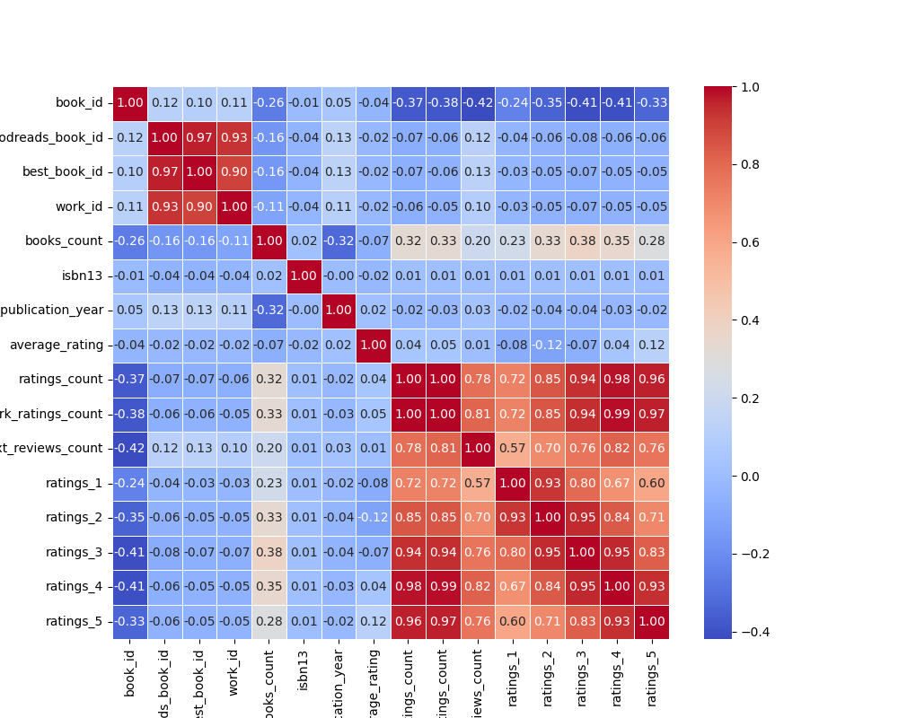
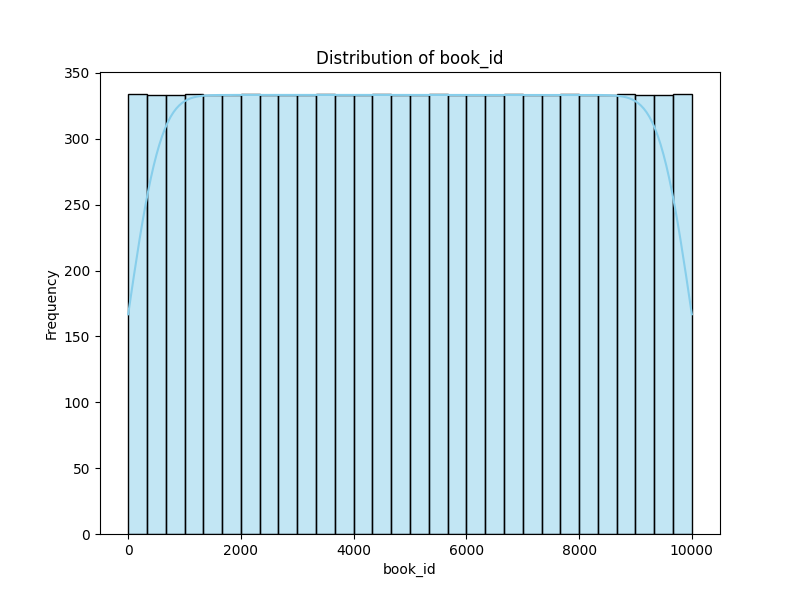
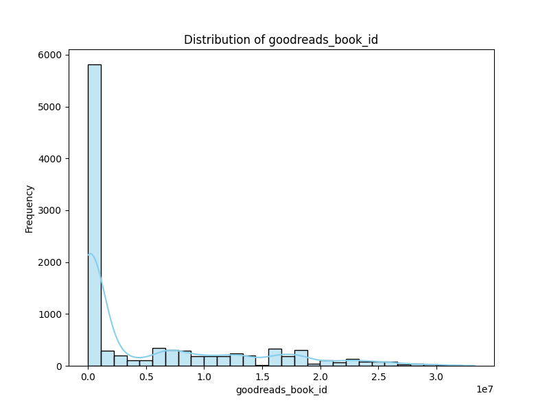
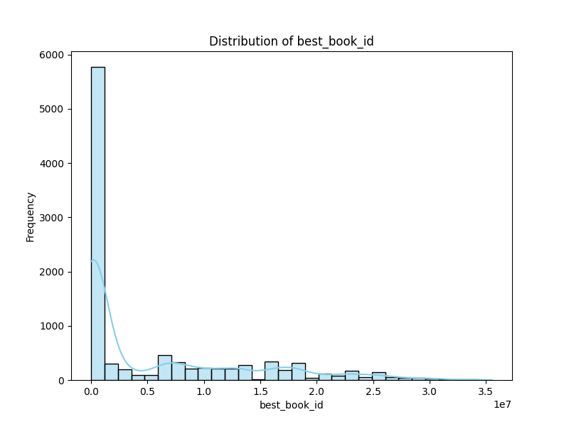
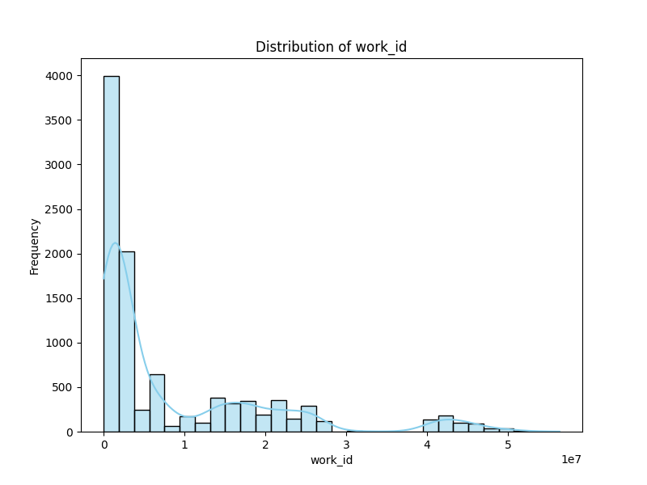
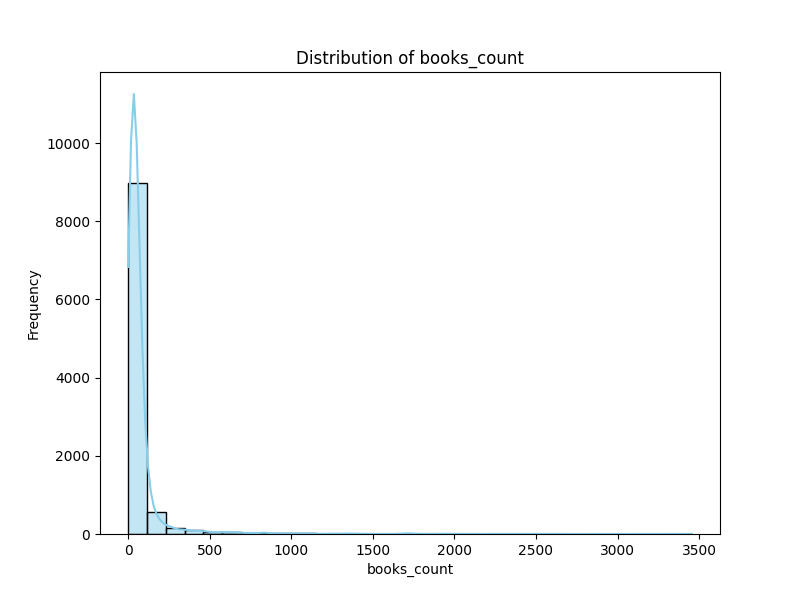
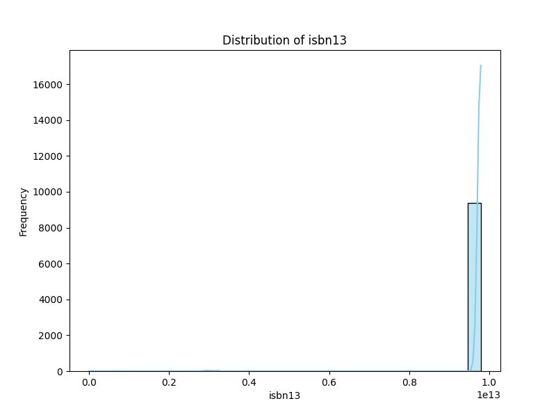

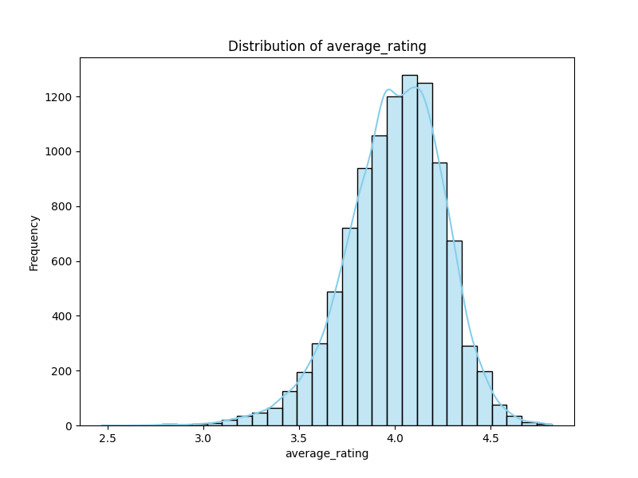
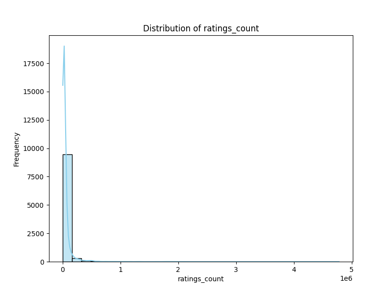
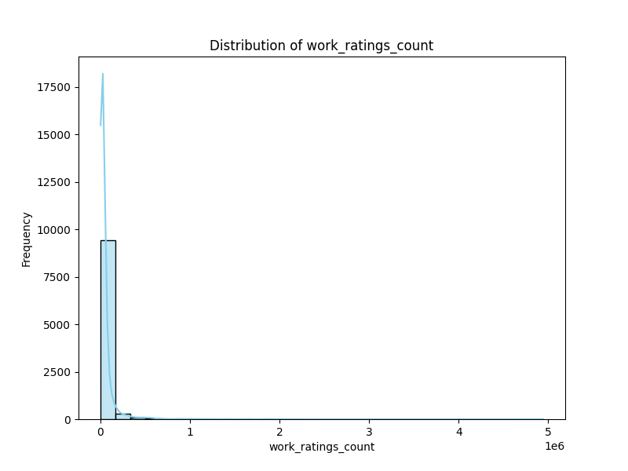
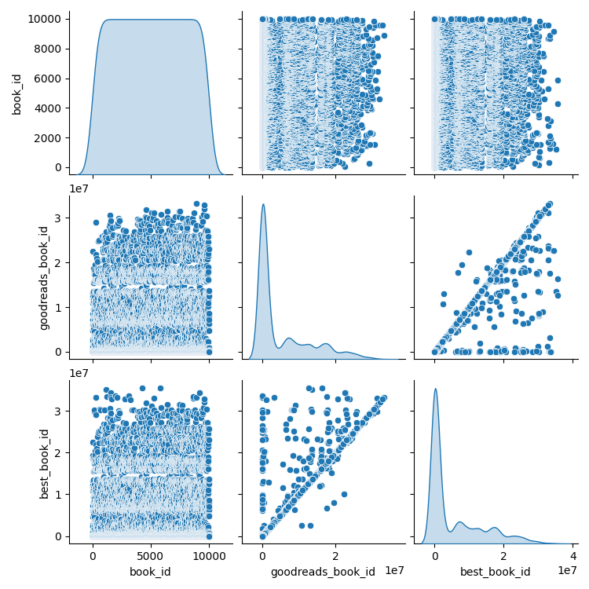
