# Analysis Report

## Dataset: happiness.csv

## Insights
Based on the provided summary statistics, missing values, correlations, and cluster summaries of the dataset `happiness.csv`, we can derive several insights:

### General Observations:
1. **Country Representation:**
   - The dataset includes information from **2363** entries across **165** unique countries, indicating a diverse representation for the study of happiness indices.

2. **Temporal Coverage:**
   - The year range spans from **2005** to **2023**, with an average year of **2014.76**. Majority of the data points are concentrated around recent years.

### Missing Values Analysis:
- Several features exhibit missing values, which may impact the overall analysis:
  - **Log GDP per capita:** 28 missing
  - **Social support:** 13 missing
  - **Healthy life expectancy at birth:** 63 missing
  - **Freedom to make life choices:** 36 missing
  - **Generosity:** 81 missing
  - **Perceptions of corruption:** 125 missing
  - **Positive affect:** 24 missing
  - **Negative affect:** 16 missing

Given the number of missing values for certain features (especially 'Perceptions of corruption'), it's important to address these before performing further analysis, either by imputation or exclusion.

### Descriptive Statistics:
- **Life Ladder:** This is the primary measure of happiness with a mean of **5.48** indicating moderate levels of overall happiness worldwide.
- **Log GDP per capita:** The average is about **9.4**, suggesting that countries with higher GDP tend to report more happiness.
- **Social Support:** The mean score is **0.81**, indicating a generally high level of perceived social support in the countries.
- **Healthy Life Expectancy at Birth:** Averaging **63.4 years**, this suggests a correlation between health and happiness.
- **Freedom to Make Life Choices:** An average score of **0.75** shows that people feel a good degree of autonomy in their lives.
- **Generosity and Perceptions of Corruption:** With averages around **0.00** and **0.74**, respectively, revealing significant variation in generosity and noticeable perceptions of corruption affecting happiness.

### Correlations:
- **Life Ladder vs. Log GDP per capita**: Strong positive correlation (**0.78**) indicates that countries with higher economic performance report higher happiness levels.
- **Life Ladder vs. Social Support**: Also a strong positive correlation (**0.72**), reflecting the impact of social networks on well-being.
- **Freedom to Make Life Choices** has a notable correlation with happiness (**0.54**), suggesting that personal autonomy is an important factor in happiness.
- **Negative Affect**: This feature exhibits a moderate negative correlation with Life Ladder (-0.35), indicating that higher negative emotions are linked with lower happiness.

### Insights:
1. **Economic and Social Factors**: Economic prosperity and social support are the strongest factors influencing perceived happiness, reaffirming Maslow's hierarchy where basic needs and social relationships underpin well-being.
  
2. **Potential Outliers**: Some countries may score unusually high or low on specific attributes (such as perceptions of corruption), which would be valuable for a more nuanced analysis or focused interventions.

3. **Need for Further Analysis**: Given the broad range of features and their interconnectedness, additional analysis (such as regression analysis) could shed light on how these factors work together to influence happiness.

4. **Focus Areas for Improvement**: Countries looking to improve their happiness levels might focus on enhancing social support systems, ensuring economic growth benefits all citizens, and reducing corruption perceptions.

### Next Steps:
- **Data Cleaning**: Address missing values to improve analysis reliability.
- **Deeper Statistical Analysis**: Implement regression models or machine learning clustering to identify factors that may serve as predictors for the happiness score or to segment countries into clusters based on their happiness profiles.

By focusing on the key correlations and the areas with the most impact, stakeholders can consider targeted policy interventions to improve overall happiness across different nations.

## Visualizations

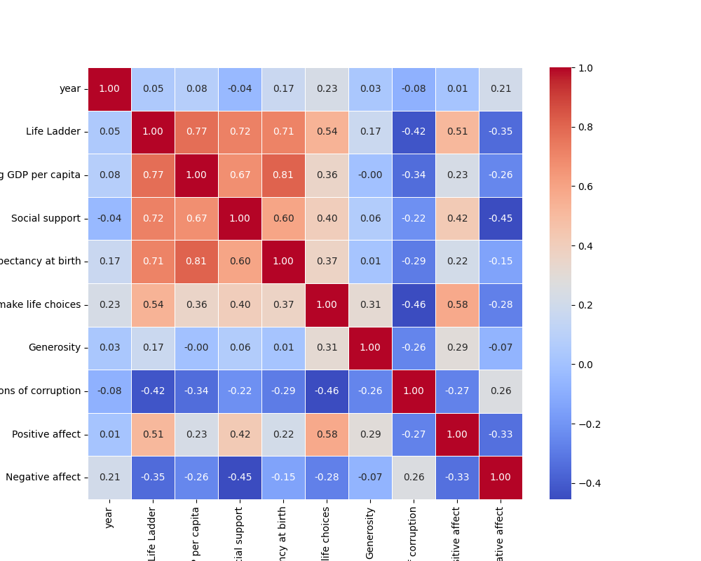
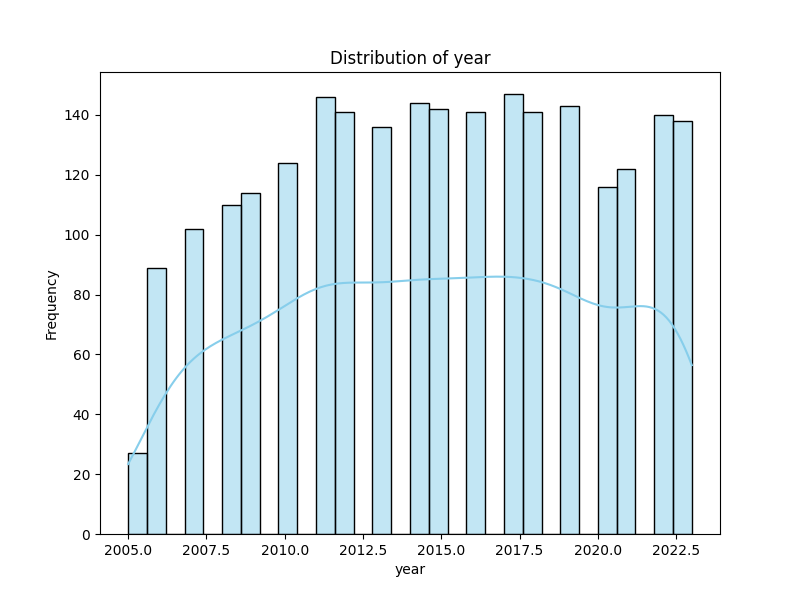
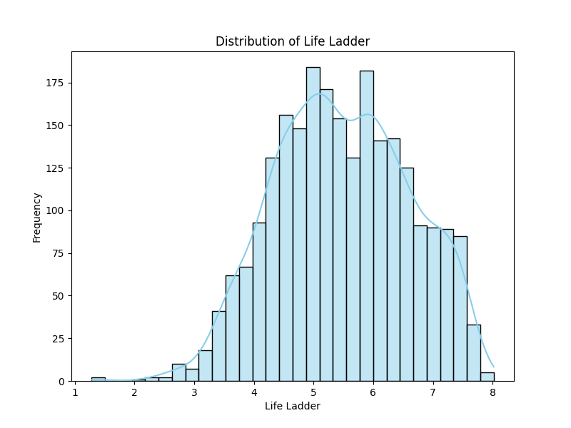

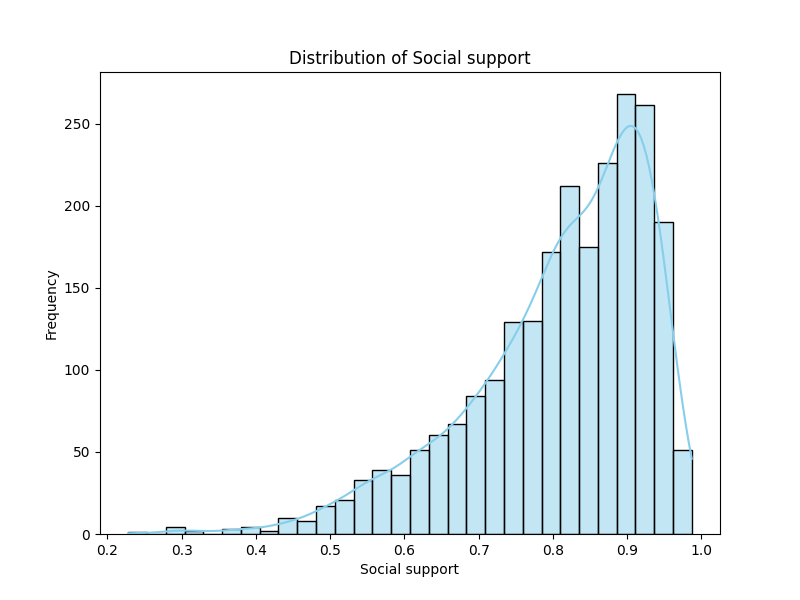
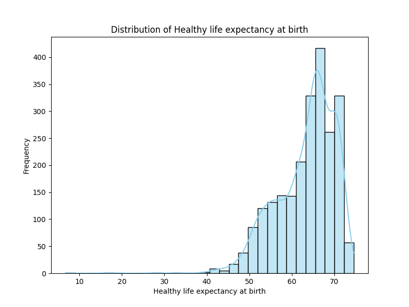
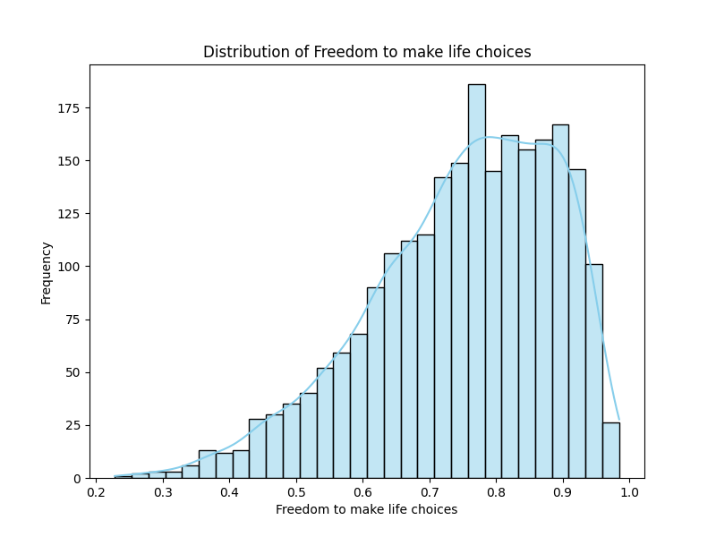
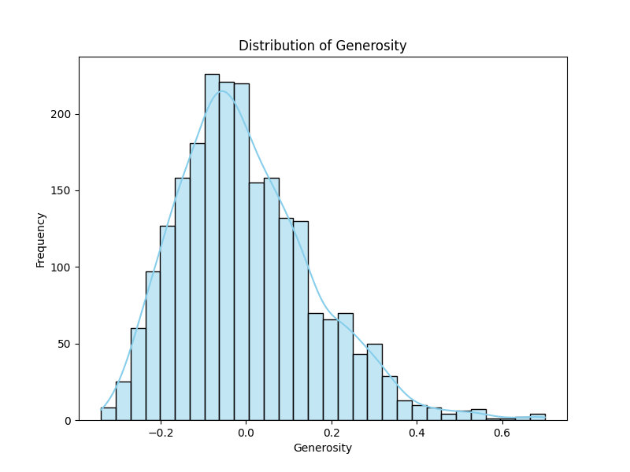
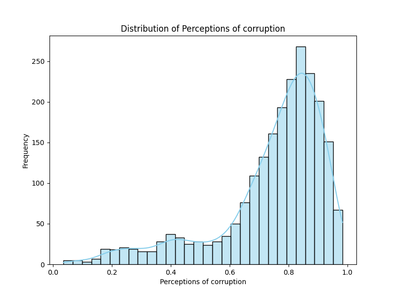
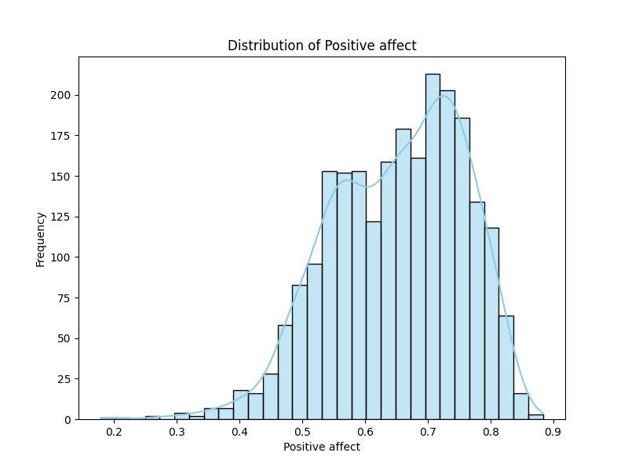
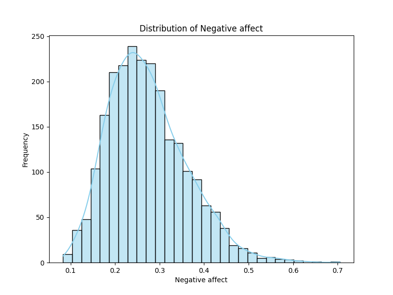
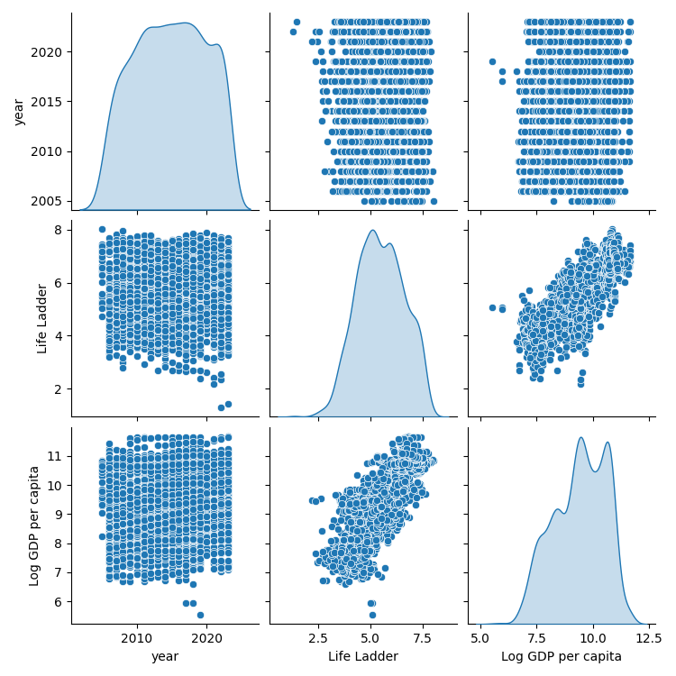
