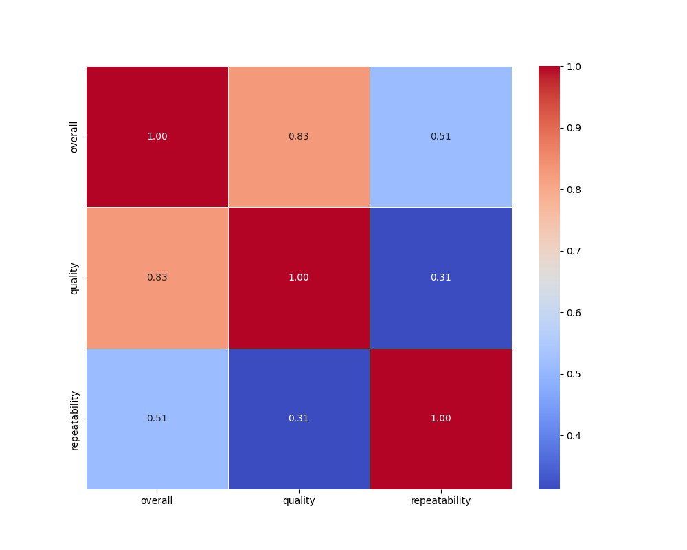
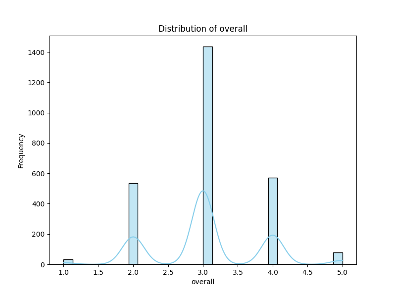
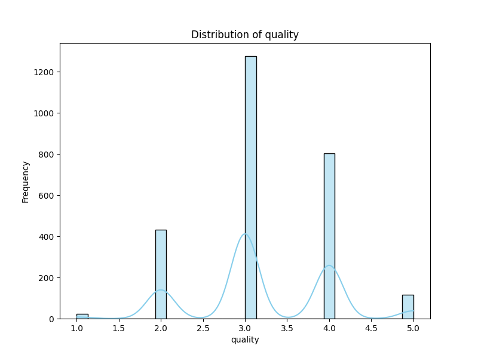
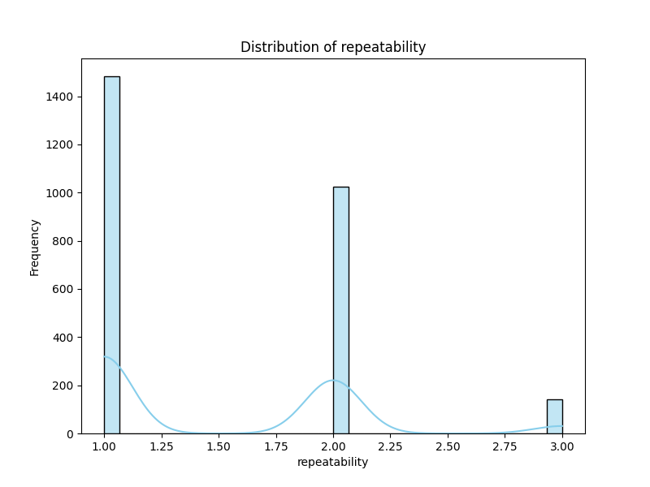
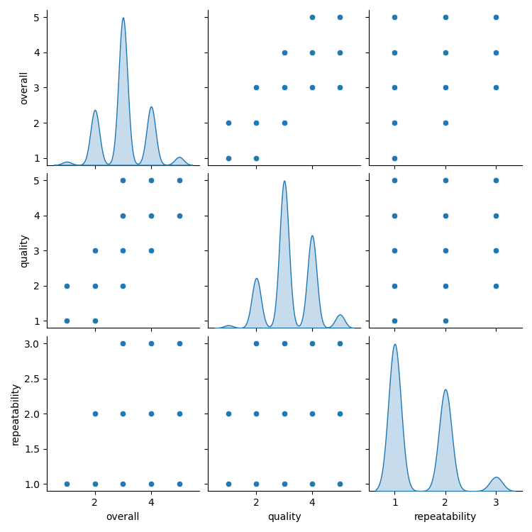
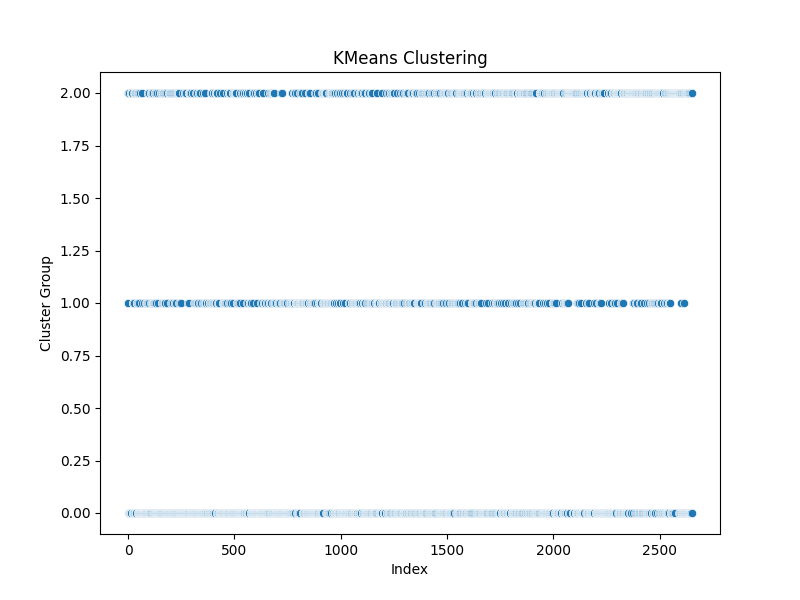

# Analysis Report

## Dataset: media.csv

## Insights
Based on the summary and analysis of the `media.csv` dataset, here are some insights:

### General Overview
- **Dataset Size**: The dataset contains a total of 2,652 entries, with varying numbers of each type.
- **Attributes**:
  - The attributes include `date`, `language`, `type`, `title`, `by`, `overall`, `quality`, and `repeatability`.
  - The dataset has observations in 11 different languages and consists of 8 different types (presumably media types, such as movie, series, etc.).
  
### Key Insights

#### Temporal Distribution
- **Date**: The `date` attribute has 99 missing values, which may affect any time-series analysis or trends you might want to observe.

#### Language and Type
- **Language Frequency**: English appears to be the most commonly reported language with 1,306 occurrences, suggesting a potential language bias in the dataset.
- **Type Distribution**: The dataset includes multiple media types, with the majority being movies, as indicated by the frequency of `type` values.

#### Titles and Contributors
- **Most Frequent Title**: "Kanda Naal Mudhal" is the most repeated title with 9 entries.
- **Frequent Contributors**: The name "Kiefer Sutherland" is noted but may reflect titles he is involved in. It appears that the dataset includes various contributors, but 262 entries are missing this information.

#### Ratings Analysis
- **Overall Ratings**: The average overall rating is approximately 3.05, with a standard deviation of 0.76. This suggests that most entries are rated around the middle of a 1-5 scale.
- **Quality Ratings**: The average quality rating is about 3.21, indicating a slightly higher perceived quality than the overall rating.
- **Repeatability**: The mean repeatability is 1.49, suggesting that most media are not expected to be repeated often, as values range from 1 to 3.

#### Correlation Insights
- The correlation between `overall` and `quality` ratings is strong (0.83), indicating that higher overall ratings tend to correspond with higher quality ratings.
- There is a moderate correlation between `overall` ratings and `repeatability` (0.51), suggesting that media rated higher could be more likely to be revisited or recommended.
  
#### Clustering Summary
- The dataset can be understood in terms of 3 clusters:
  - **Cluster 0**: The largest cluster with 1,315 entries, representing the most common features of the dataset.
  - **Cluster 2**: The second largest with 769 entries, potentially capturing a unique attribute or type of media.
  - **Cluster 1**: The smallest cluster with 568 entries, indicating a niche or less frequent type of media.

### Recommendations
- **Data Cleaning**: Consider addressing the missing `date` and `by` values to enhance the dataset's completeness.
- **Further Analysis**: Analyze the clustering to identify specific characteristics of each cluster. This can help in understanding targeted recommendations or the diversity of media.
- **Temporal Analysis**: Investigate trends over time using the `date` information to potentially reveal shifts in media consumption or preferred styles.

### Conclusion
This dataset serves as a foundation for analyzing media content, user experiences, and preferences. With some cleaning and targeted analysis, richer insights can be drawn regarding media consumption trends and characteristics.

## Visualizations

